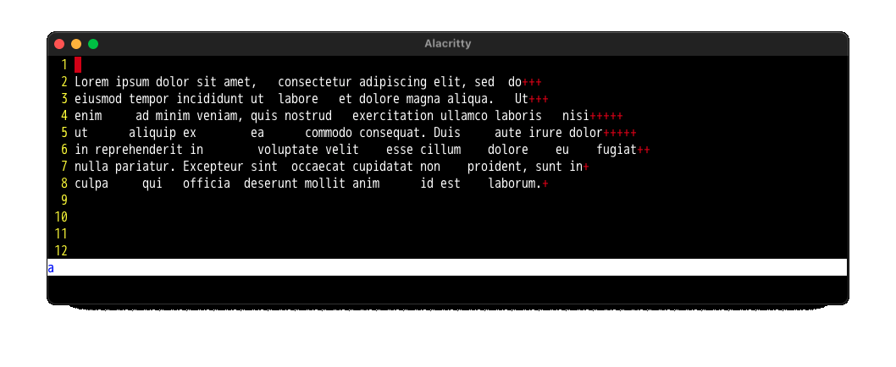
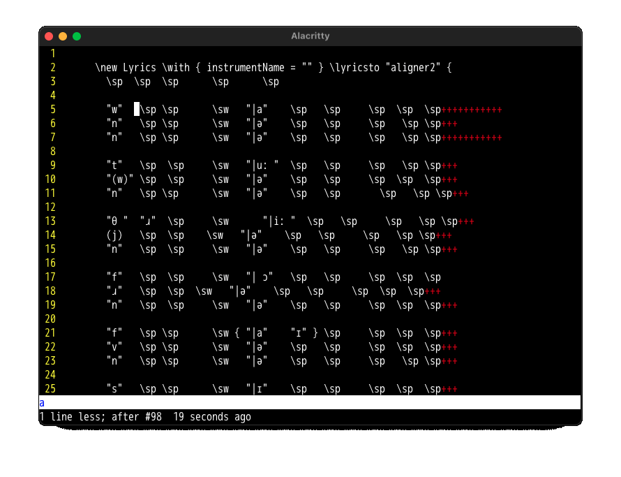

# AlignKwds – Keyword-Aware Alignment for Neovim

> A Neovim plugin to align keyword-based tables (PBS/NPBS) with span-aware precision.





`AlignKwds` is a Neovim plugin written in Lua that neatly aligns tokens into columns based on **spaces (PBS Potential Blank Space Characters)** and **non-spaces (NPBS Non-Potential Blank Space Characters)**.

It is *span-aware* (handles quotes, parentheses, braces, etc.), supports **custom blank characters**, and even lets you treat **keywords like `\sp` or `\sw` as spaces** as well as specified characters.
---

## Special Thanks to ChatGPT-5

<!--
## Special thanks goes to ChatGPT5

In most of my life, I have been extensively learning Pascal, Java, JavaScript,
and other languages but Lua. And I have zero knowledge about Lua before. But
thanks to the coming of ChatGPT, I could write lua program which runs on
NeoVim.

In most of my life, I have been speaking only Japanese. But the coming of
ChatGPT made me available to write User Manual in English.

This manual was mostly written by ChatGPT, except this section.

Thank you, ChatGPT, and thank you God.
-->

For most of my life I studied and worked with Pascal, Java, JavaScript, and many other languages — but never Lua. Before this project I had zero knowledge of Lua. Thanks to the arrival of ChatGPT, I was able to write a Lua program that runs inside Neovim.

Similarly, for most of my life I spoke only Japanese. Yet with ChatGPT’s help, I was able to write this User Manual in English.

This manual was written mostly with ChatGPT’s assistance, except for this section.

Thank you, ChatGPT — and thank You, God.


## 📦 Installation

### With [lazy.nvim](https://github.com/folke/lazy.nvim)

```lua
{
  "ats4u/AlignKwds",
  cmd = "AlignKwds",
  opts = {
    pbs_chars = " \t",
    pbs_keywords = { "\\sp", "\\sw" },
    pbs_keywords_in_spans = false,
  },
  config = function(_, opts)
    require("align_kwds").setup(opts)
  end,
}
```

### With packer.nvim

```lua
use {
  "ats4u/AlignKwds",
  config = function()
    require("align_kwds").setup({
      pbs_chars = " \t",
    })
  end
}
```

After installation, the command `:AlignKwds` is available.

---

## 🚀 Basic Usage

1. Select lines in visual mode, or position cursor inside a block of text.
2. Run:

```
:'<,'>AlignKwds
```

This aligns the selection.
If no range is given, it auto-expands to the contiguous block around the cursor.

---

## ⚙️ Options

You can configure behavior either in `opts` (at setup) or per call on the command line.

### 1. PBS characters

Default: `" \t"`

```vim
:'<,'>AlignKwds pbs=" \t{}"
```

Braces `{}` are treated like spaces.

---

### 2. PBS keywords

Sequences that behave like spaces:

```vim
:'<,'>AlignKwds pbs=" \t" pbskw="\\sp \\sw"
```

---

### 3. PBS keywords inside spans

By default, keywords inside quotes/parentheses are *not* treated as PBS.
Override with:

```vim
:'<,'>AlignKwds pbskw="\\sp" pbskw_in_spans=true
```

---

### 4. Protected pairs (spans)

Default: `() ""`

```vim
:'<,'>AlignKwds pairs="() [] {} \"\""
```

---

### 5. Escape character

Default: `\`

```vim
:'<,'>AlignKwds esc="\\"
```

---

### 6. Block expansion

If no range is given, aligns the contiguous block around the cursor.
Disable:

```vim
:'<,'>AlignKwds block=false
```

---

## 📐 Examples

### Example 1 — Normal spaces

PBS = `" \t"`

```
foo { bar } baz
foo baz bum
```

→

```
foo { bar } baz
foo baz      bum
```

---

### Example 2 — Braces as spaces

PBS = `" \t{}"`

```
foo { bar } baz
foo baz bum
```

→

```
foo { bar } baz
foo   baz   bum
```

---

### Example 3 — Keywords as spaces

PBS = `" \t"`, PBS keywords = `{"\sp","\sw"}`

```
"w" \sp \sw "|a"
"n" \sp \sw "|ə"
```

→

```
"w"   \sp \sw   "|a"
"n"   \sp \sw   "|ə"
```

---

## 🔒 Guarantees

* **Idempotent**: running twice doesn’t change the result.
* **Span-aware**: quoted or parenthesized blocks stay intact.
* **Verbatim**: all tokens are preserved exactly.
* **Unicode-safe**: uses display width (so wide chars align correctly).

---

## 🛠️ Tips

* Use `pbskw` for macros like `\sp`, `\sw`, `\tab`.
* Add exotic blanks (e.g. full-width space `\u{3000}`) to `pbs`.
* Define more pairs if you align JSON, Lisp, or LaTeX code.
* Debugging helper: we can add `:AlignKwdsDebug` to show how a line splits into PBS/NPBS.

---

